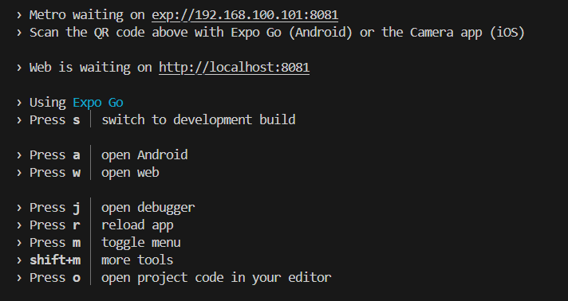
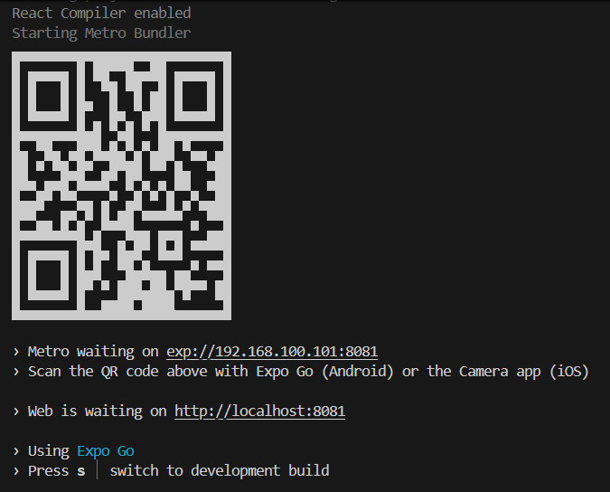

# Formulario-expo

Para rodar o projeto, navegue até o diretorio e rode um dos seguintes npm comandos:

To run your project, navigate to the directory and run one of the following npm commands.

- cd formulario
- npm run start # Este gerara um QR code que basta scannear com o celular que você será levado ao aplicativo. (É necessário baixar o aplicativo "Expo Go"), após isso basta apenas selecionar a plataforma que deseja

- npm run android
- npm run ios # you need to use macOS to build the iOS project - use the Expo app if you need to do iOS development without a Mac
- npm run web

