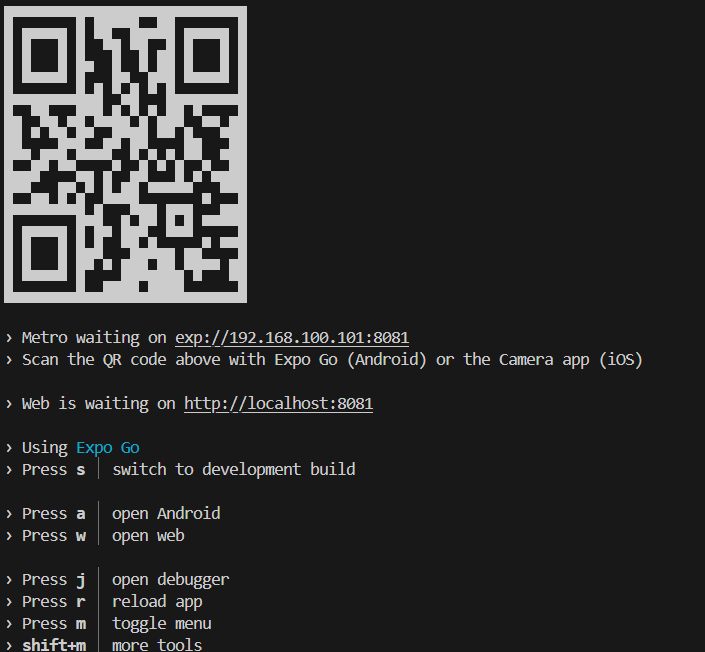

# Formulário Expo

Este projeto é um aplicativo desenvolvido com React Native utilizando Expo. O objetivo é criar um formulário com validação de campos, integração com geolocalização e navegação entre telas. O projeto inclui também integração com APIs públicas, validação de formulários e boas práticas de organização de código

## Tecnologias Utilizadas

- React Native
- Expo
- Expo Router
- TypeScript
- NativeWind
- Expo Location e Web Geolocation

## Descrição do Projeto

O aplicativo apresenta um formulário dividido em etapas, onde o usuário informa dados como nome, e-mail, senha e telefone. Os campos obrigatórios passam por validação, e o aplicativo também obtém a localização atual do usuário

A geolocalização foi implementada com tratamentos distintos entre mobile e web, considerando as diferenças de suporte entre bibliotecas e APIs

## Instruções de Instalação

Clone o repositório:
git clone https://github.com/KaueMFulgencio/Formulario-expo.git

Acesse o diretório do projeto:
cd Formulario-expo

Instale as dependências:
npm install

Inicie o projeto:
npm run start

O Expo Developer Tools será aberto no navegador e exibirá um QR Code. Para testar no celular, utilize o aplicativo Expo Go disponível na Play Store e App Store

Para executar em plataformas específicas:
npm run android
npm run ios     # Requer macOS
npm run web

## Decisões Técnicas Tomadas

### Utilização do Expo
O Expo era necessidade obrigatória

### Estilização com NativeWind
O NativeWind foi utilizado por permitir estilização com classes utilitárias semelhantes ao TailwindCSS, promovendo maior produtividade e padronização. Selecionei também pois possuo afinidade com o Tailwind que utilizo em outro projeto

### Adaptação da Geolocalização
A implementação da geolocalização exigiu ajustes devido à compatibilidade entre plataformas:
- A biblioteca inicial testada (@react-native-community/geolocation) não era compatível com Expo
- Em dispositivos mobile, foi utilizada a biblioteca expo-location
- No ambiente web, utilizou-se a API navigator.geolocation
- A solução final identifica automaticamente a plataforma e define o método adequado

### Navegação com Expo Router
O Expo Router foi escolhido por oferecer uma arquitetura de rotas simples, declarativa e escalável, baseada em arquivos

## Dificuldades Encontradas

### Geolocalização Multiplataforma
A principal dificuldade foi implementar uma solução funcional tanto no mobile quanto no navegador. Após testar bibliotecas incompatíveis com o Expo, foi necessário combinar abordagens distintas e adaptar a lógica conforme a plataforma

### Responsividade
A interface precisou ser ajustada para funcionar adequadamente em diferentes tamanhos de tela, desde smartphones até dispositivos desktop, exigindo revisões estruturais e de estilização

## Melhorias Futuras
- Melhorar a usabilidade dos campos de input
- Implementar armazenamento para evitar duplicações e manter registros persistentes
- Validação de formulário utilizando Formik, React Hook Form e etc
- Adicionar sistema de tema claro/escuro com alternância dinâmica
- Criar testes automatizados para validação e fluxo do formulário
- Criar testes unitarios
